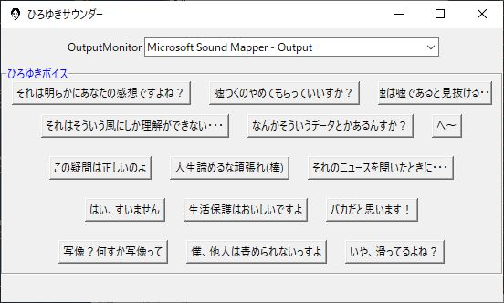

# Hiroyuki_Sounder
ひろゆきのボイスを指定したオーディオデバイスに流すことができるPythonのアプリケーションです。
(必要追加ライブラリは PyAudioです。)



## 環境構築・実行
PyAudio をインストールしてください。 PyAudio をインストール後、このリポジトリ を Fork して git clone してください。
この.pyファイルの入っているPathに移動したら以下のコマンドを実行してください。

```bash
python hiroyuki_sounder.py
```

### 声の主
西村博之（にしむらひろゆき）'76年、神奈川県生まれ。フランス在住、たまに日本。2ちゃんねる・ニコニコの元管理人で、英語圏最大の掲示板サイト『4chan』現管理人。（「SPA!」より引用）


